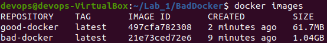
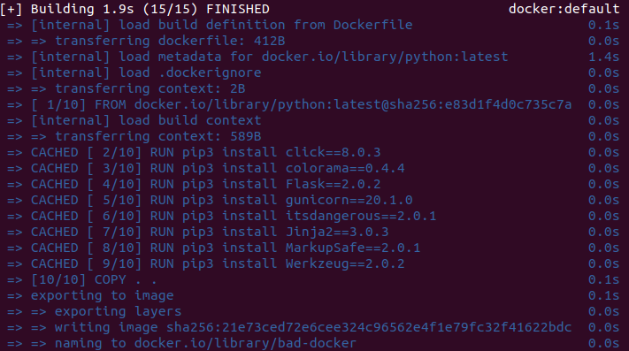
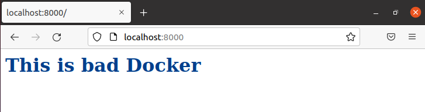
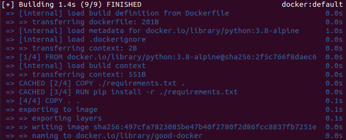
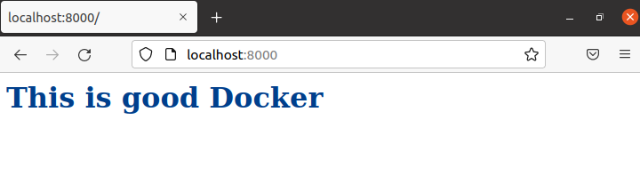

# Лабораторная работа №1

## Цель работы

Поднять кластер Kubernetes локально, в нём развернуть свой сервис.

## Ход работы

Для выполнения работы было создано написано простое web-приложение на python, которое выводит This is bad/good docker в зависимости от Dockerfile.

**Версия приложение для плохого докера:**
```
from flask import Flask

app = Flask(__name__)

@app.route('/')
def hello():
	return '<h1 style="color: #003f8c"> This is bad Docker </h1>'
```
**Версия приложения для хорошего докера:**
```
from flask import Flask

app = Flask(__name__)

@app.route('/')
def hello():
	return '<h1 style="color: #003f8c"> This is good Docker </h1>'
```
**Dockerfile с плохими практиками:**
```
FROM python:latest AS alakasam

EXPOSE 8000

RUN pip3 install click==8.0.3
RUN pip3 install colorama==0.4.4
RUN pip3 install Flask==2.0.2
RUN pip3 install gunicorn==20.1.0
RUN pip3 install itsdangerous==2.0.1
RUN pip3 install Jinja2==3.0.3
RUN pip3 install MarkupSafe==2.0.1
RUN pip3 install Werkzeug==2.0.2

COPY . .

CMD ["gunicorn", "--bind", "0.0.0.0:8000", "app:app"]
```
**Плохие практики:**

1) Использование последней версии вместо какой-то конкретной.
   ```
   FROM python:latest
   ```
	Лучше использовать какую-то конкретную версию python, на которой проект точно работает так, как должен. Ведь, когда базовый образ обновится и тогда он перестанет быть совместимым с прочими зависимостями, прописанными в нашем образе, тогда этот образ перестанет работать или будет работать некорректно.

2) Использование непонятных имен.
   ```
   FROM python:latest AS alakasam
   ```
	Из имен должно быть понятно, что им обозначено. Непонятные имена лучше не использовать.

3) Установка каждого пакета отдельной командой.
   ```
  	RUN pip3 install click==8.0.3
	RUN pip3 install colorama==0.4.4
	RUN pip3 install Flask==2.0.2
	RUN pip3 install gunicorn==20.1.0
	RUN pip3 install itsdangerous==2.0.1
	RUN pip3 install Jinja2==3.0.3
	RUN pip3 install MarkupSafe==2.0.1
	RUN pip3 install Werkzeug==2.0.2
   ```
	Каждый RUN создает отдельный слой в образе. Чем больше слоев, тем больше весит итоговый образ и тем больше времени требуется на его сборку. Что видно из рисунка ниже:
<p align="center">
    
</p>

**Сборка плохого Dockerfile:**
<p align="center">
    
</p>

**Результат сборки:**
<p align="center">
    
</p>

**Хороший Dockerfile:**
```
FROM python:3.8-alpine AS builder
EXPOSE 8000
COPY ./requirements.txt .
RUN pip install -r ./requirements.txt
COPY . .
CMD ["gunicorn", "--bind", "0.0.0.0:8000", "app:app"]
```
В хорошем Dockerfile использованы понятные имена, использована конкретная версия python и все необходимые пакеты устанавливаются из файла requirements.txt.

**Сборка хорошего Dockerfile:**
<p align="center">
    
</p>

**Результат сборки:**
<p align="center">
    
</p>

**Плохие практики для работы с контейнером:**

1) Не надо хранить учетные данные в образе – используйте для этого переменные среды. 
  Не надо прописывать в образе никаких логинов и паролей. Вместо этого лучше использовать переменные среды, чтобы вытащить соответствующие данные из внешних по отношению к контейнеру источников.

2) Не надо хранить данные внутри контейнера. 
  В ходе жизненного цикла контейнеры могут приостанавливаться, уничтожаться, заменяться. Если приложение работает в контейнере, то версия 1.0 этого приложения должна легко меняться на версию 1.1 без потери данных.

## Вывод

В ходе лабораторной работы мы написали 2 Dockerfile, которые содержат в себе примеры хорошей и плохой практик использования.
