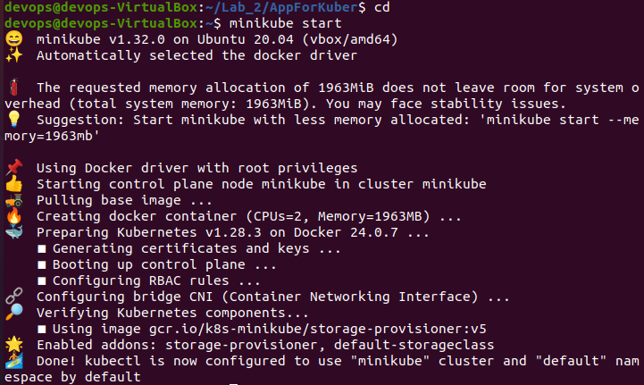
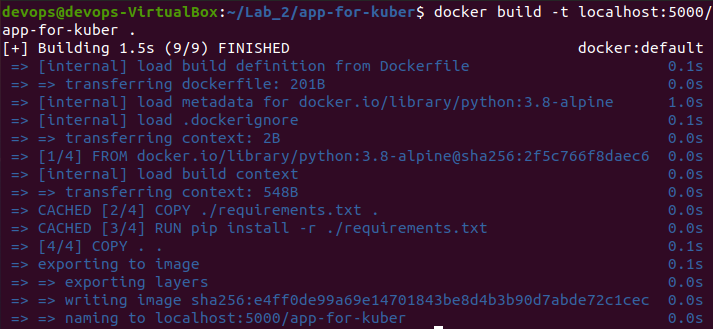
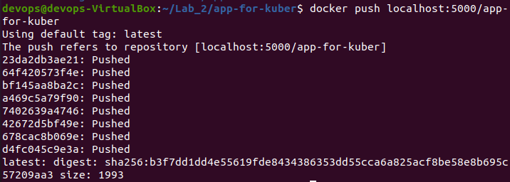
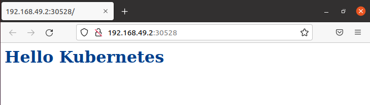

# Лабораторная работа №2

## Цель работы

Поднять кластер Kubernetes локально, в нём развернуть свой сервис.

## Ход работы

Для выполнения работы был использован локальный кластер Minikube, который позволяет поднять локальный кластер Kubernetes. После установки Minikube, был запущен кластер с помощью команды `minikube start`:
<p align="center">
    
</p>

**Создадим виртуальное хранилище образов для докера на порту 5000:**
```
minikube addons enable registry
docker run --rm -it --network=host alpine ash -c "apk add socat && socat TCP-LISTEN:5000,reuseaddr,fork TCP:$(minikube ip):5000"
```
В качестве разворачиваемого сервиса было создано приложение выводящее в браузере: "Hello Kubernetes". Для этого было создано 3 файла: Dockerfile, app.py и requirements.

Dockerfile
```
FROM python:3.8-alpine
EXPOSE 8000
COPY ./requirements.txt .
RUN pip install -r ./requirements.txt
COPY . .
CMD ["gunicorn", "--bind", "0.0.0.0:8000", "app:app"]
```
app.py
```
from flask import Flask

app = Flask(__name__)

@app.route('/')
def hello():
	return '<h1 style="color: #003f8c"> Hello Kubernetes </h1>'
```
requirements
```
click==8.0.3
colorama==0.4.4
Flask==2.0.2
gunicorn==20.1.0
itsdangerous==2.0.1
Jinja2==3.0.3
MarkupSafe==2.0.1
Werkzeug==2.0.2
```
**После создания всех необходимых файлов был собран докер-образ:**
<p align="center">
    
</p>
<p align="center">
    
</p>

Для того чтобы можно было развернуть созданное приложение с помощью kubernetes необходимо прописать манифесты (Deployment и Service) в формате yalm-файлов.

**deployment.yalm:**
```
apiVersion: apps/v1
kind: Deployment
metadata:
  name: kuber-app
spec:
  replicas: 1
  selector:
    matchLabels:
      app: kuber-app
  template:
    metadata:
      labels:
        app: kuber-app
    spec:
      containers:
      - name: kuber-app
        image: localhost:5000/app-for-kuber
        ports:
          - containerPort: 8000
```
**service.yalm:**
```
apiVersion: v1
kind: Service
metadata:
  name: kuber-app
spec: 
  selector:
    app: kuber-app
  ports:
    - port: 8000
      protocol: TCP
      targetPort: 8000
  type: LoadBalancer
```
Для создания объектов в kubernetes нужно воспользоваться следующими командами:
```
kubectl apply -f deployment.yalm
kubectl apply -f service.yalm
```
Сервис был запущен с помощью команды `minikube service kuber-app`
**Результат:**
<p align="center">
    
</p>

## Вывод

В результате выполнения лабораторной работы был поднят кластер Kubernetes локально, в нём был развернут свой сервис.
