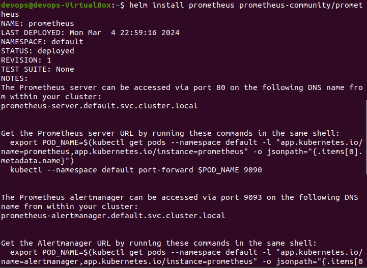
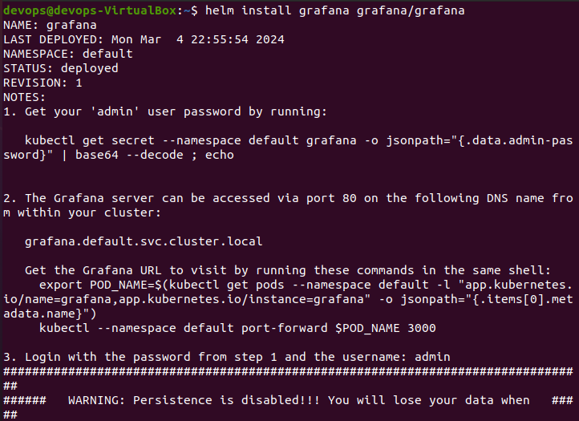
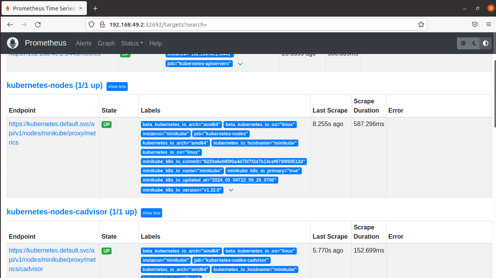

# Лабораторная работа №4

## Цель работы

Сделать мониторинг сервиса с помощью prometheus и grafana

## Ход работы

**Установка Prometheus:**
```
helm repo add prometheus-community https://prometheus-community.github.io/helm-charts
helm install prometheus prometheus-community/prometheus
```
<p align="center">
    
</p>

**Установка Grafana:**
```
helm repo add grafana https://grafana.github.io/helm-charts
helm install grafana grafana/grafana
```
<p align="center">
    
</p>

Запуск сервисов Prometheus и Grafana:
```
kubectl expose service prometheus-server --type=NodePort --target-port=9090 --name=prometheus-server-np
kubectl expose service grafana --type=NodePort --target-port=3000 --name=grafana-np
```
После запуска сервиса Prometheus с помощью команды `minikube service prometheus-server-np` открылась страница в браузере:
<p align="center">
    
</p>


## Вывод

