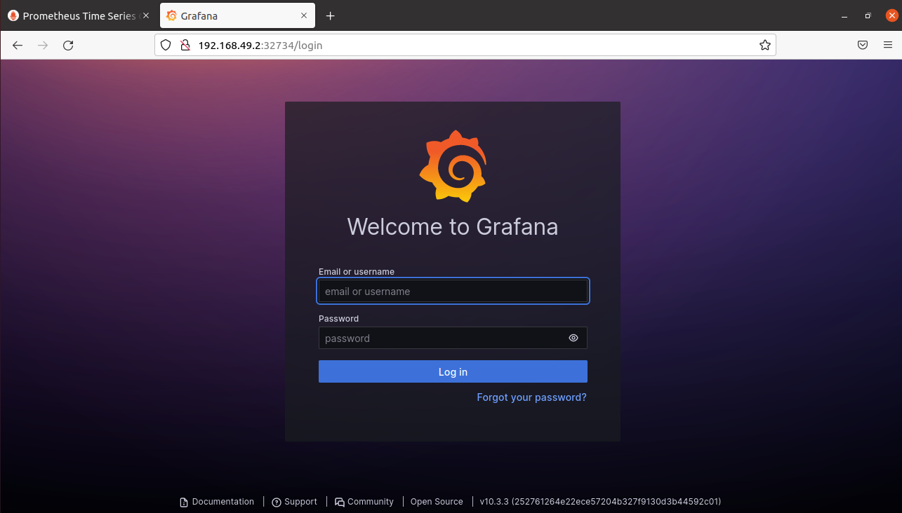
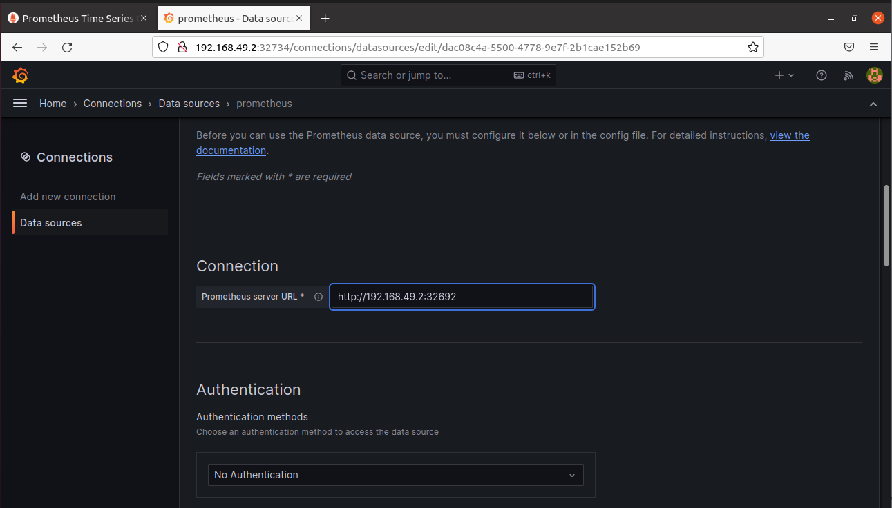
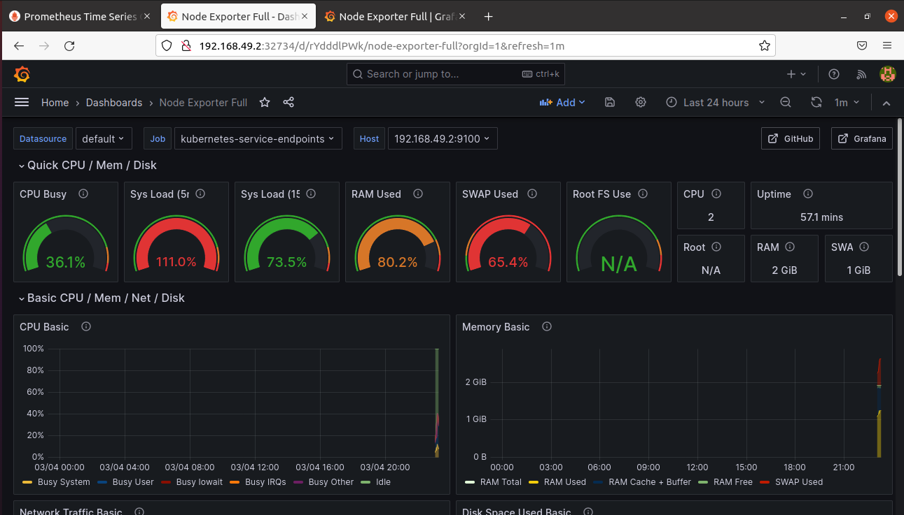

# Лабораторная работа №4

## Цель работы

Сделать мониторинг сервиса с помощью prometheus и grafana

## Ход работы

**Установка Prometheus:**
```
helm repo add prometheus-community https://prometheus-community.github.io/helm-charts
helm install prometheus prometheus-community/prometheus
```
<p align="center">
    
</p>

**Установка Grafana:**
```
helm repo add grafana https://grafana.github.io/helm-charts
helm install grafana grafana/grafana
```
<p align="center">
    
</p>

Запуск сервисов Prometheus и Grafana:
```
kubectl expose service prometheus-server --type=NodePort --target-port=9090 --name=prometheus-server-np
kubectl expose service grafana --type=NodePort --target-port=3000 --name=grafana-np
```
После запуска сервиса Prometheus с помощью команды `minikube service prometheus-server-np` открылась страница в браузере:
<p align="center">
    
</p>

Запуск Grafana с помощью команды `minikube service grafana-np`:
<p align="center">
    
</p>

Для того, чтобы войти в сервис Grafana нужно ввести логин, в нашем случае: admin и пароль, который был получен с помощью команды:
```
kubectl get secret --namespace default grafana -o jsonpath="{.data.admin-password}" | base64 --decode
```
После было настроено получение Grafana метрик с Prometheus. Для этого в разделе «connection - data source». Было добавлено соединение с Prometheus.
<p align="center">
    
</p>

После был создан новый Dashboard в качестве типа отображения был импортирован node-exporter-full (по id) на странице, которую рекомендует Grafana (https://grafana.com/grafana/dashboards/)
<p align="center">
    
</p>

## Вывод

Был успешно настроен мониторинг сервиса, запущенного в Kubernetes, с использованием Prometheus и Grafana. Было настроено отображение графиков для отслеживания нагрузки
